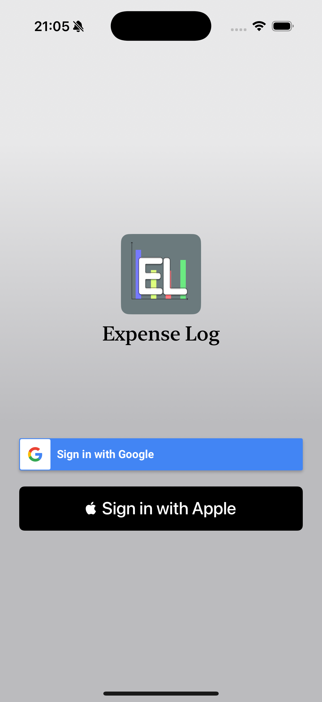
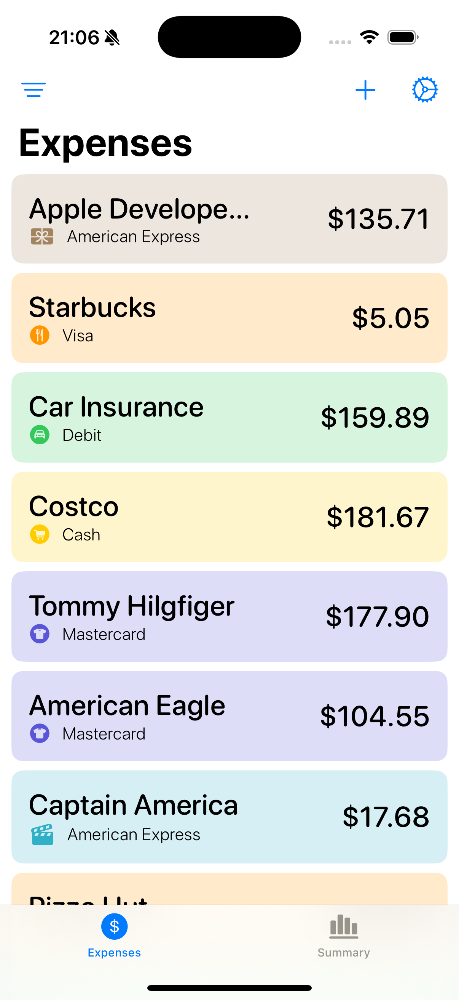
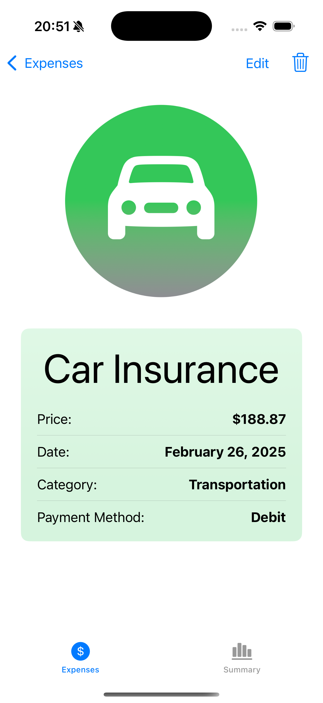
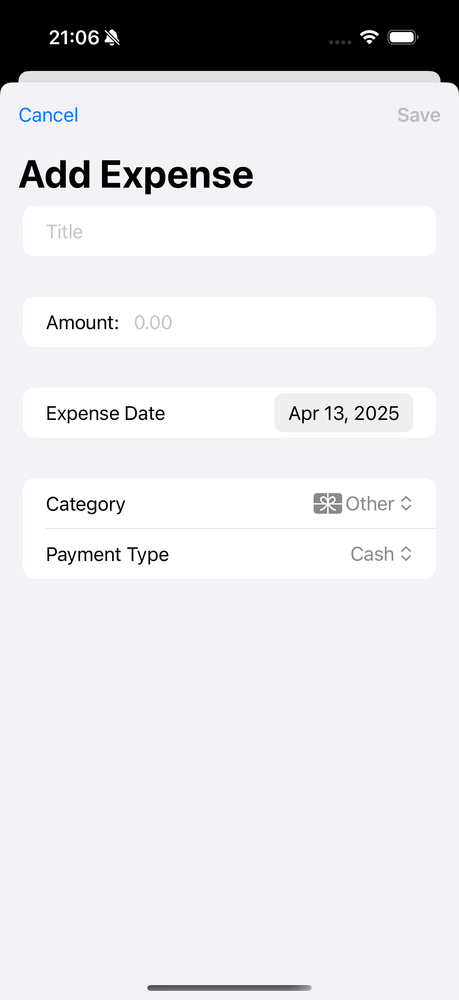
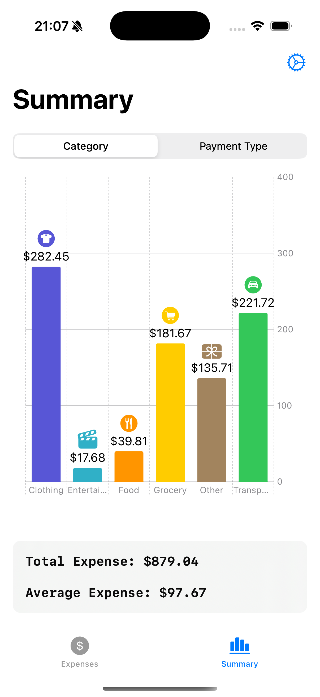
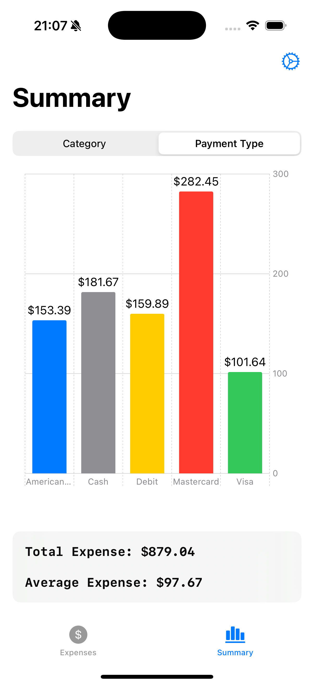
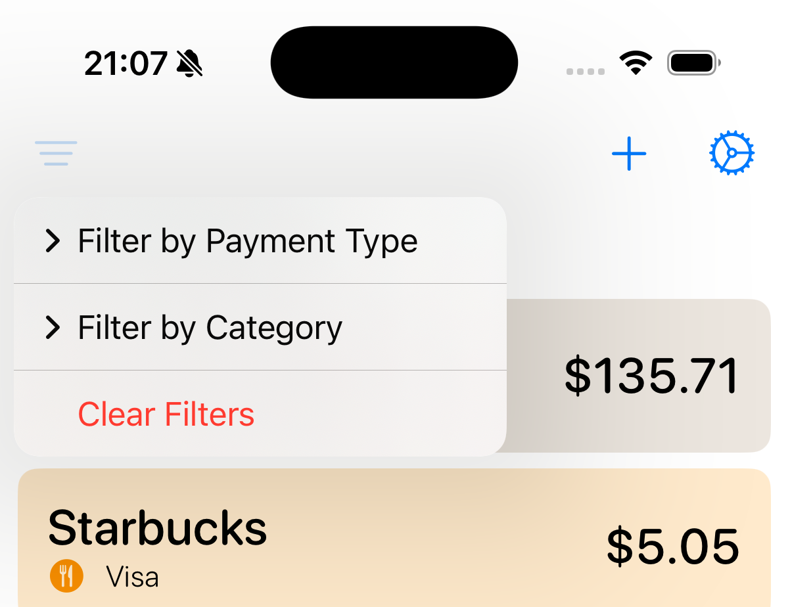
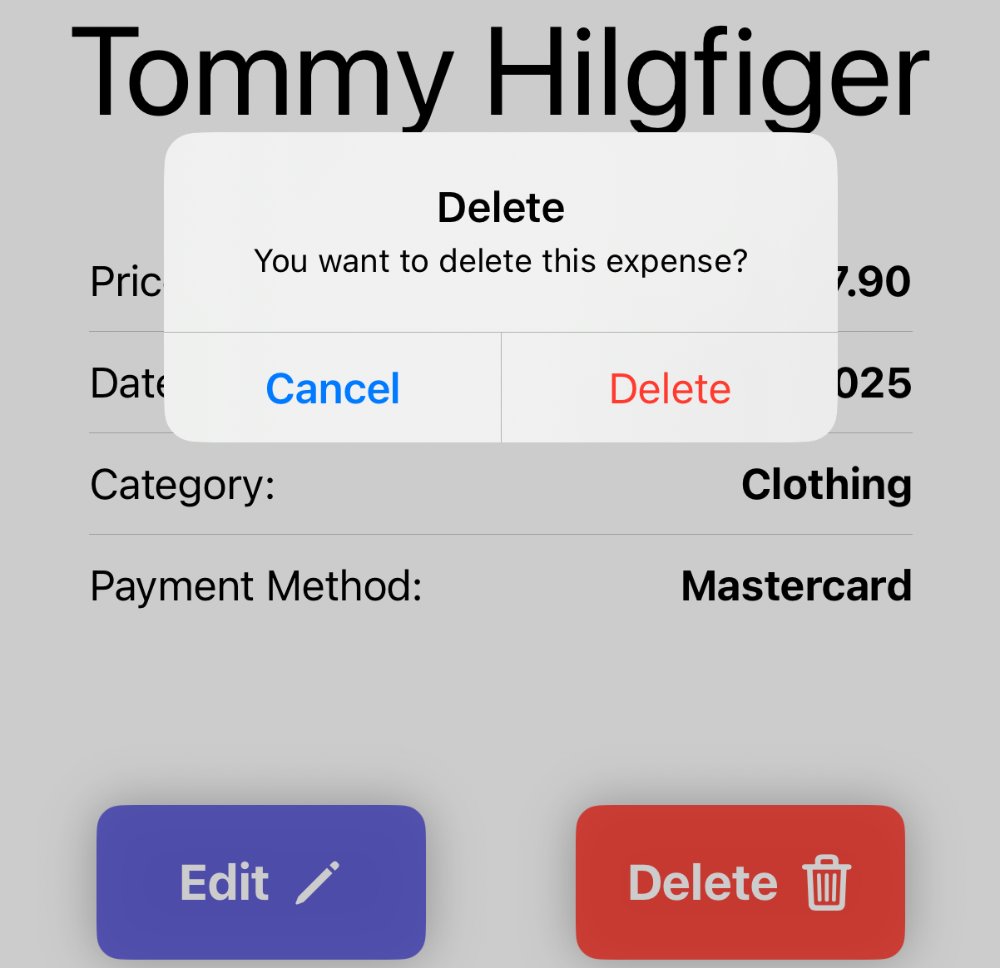
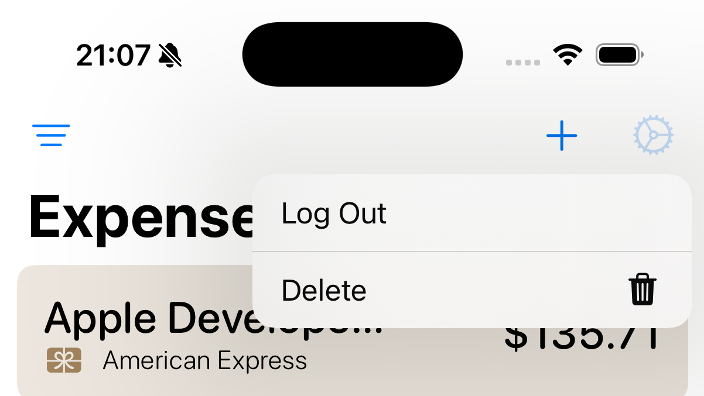

# 📊 ExpenseLog

**ExpenseLog** is a modern and user-friendly expense tracking iOS app built with **SwiftUI** and **Firebase**. It allows users to effortlessly add, view, and filter their daily expenses by category and payment type. This app ensures a smooth and seamless experience by leveraging cloud-based storage and Firebase services to store and manage expenses in real-time.

---

## 🚀 Features

- 🔐 **Firebase Authentication**  
  Supports Google Sign-In and Apple Sign-In to provide a secure and convenient sign-in experience for users.

- 💾 **Cloud Firestore**  
  Real-time data synchronization with Firestore, allowing users to add, update, and delete expenses on any device with immediate changes reflected across all devices.

- ➕ **Add, Update, and Delete Expenses**  
  Effortlessly add new expenses, update existing ones, or delete them as needed. Each expense record includes the category, payment type, and amount.

- 🧾 **Filter Expenses**  
  Users can filter their expenses based on payment type (e.g., Credit, Debit, Cash) or category (e.g., Groceries, Entertainment, Bills), providing an easy way to manage and view expenses.  

- 🧹 **Account Deletion**  
  An option to permanently delete the user's account, along with all related data (expenses, profile, etc.) from the app and Firestore.

- 🎨 **Clean, Responsive UI**  
  Designed using SwiftUI, the app ensures a modern and intuitive user interface, with smooth transitions and a responsive layout optimized for iPhone devices.

- 🔊 **Haptic Feedback**  
  Provide haptic feedback throughout the app for an enhanced user experience, especially when interacting with buttons or performing critical actions.

---

## 🛠 Tech Stack

- **SwiftUI**  
  A declarative framework to build a modern, responsive, and seamless UI for iOS apps, ensuring the app is fast and easy to maintain.

- **Firebase Authentication**  
  Secure user authentication via Firebase, supporting both Google Sign-In and Apple Sign-In.
   > ⚠️ Apple Sign-In requires an active Apple Developer Account to enable and test on physical devices.  

- **Cloud Firestore**  
  NoSQL database for storing and syncing user data in real-time, enabling an always-up-to-date view of user expenses.

- **UserDefaults**  
  Used for local data persistence, such as saving user preferences or authentication states, allowing the app to offer a more personalized experience.

- **MVVM Architecture**  
  The app follows the Model-View-ViewModel (MVVM) pattern for separating concerns, enhancing maintainability, and improving testing capabilities.

- **Haptic Feedback**  
  The app uses the UIKit `UIImpactFeedbackGenerator` to provide haptic feedback to enhance user interaction.

- **Swift Package Manager**  
  Dependency management is handled by Swift Package Manager (SPM), ensuring smooth integration of external libraries like Firebase and other utilities.

---  
## 📷 Screenshots  

<h3>🔧 App UI</h3>
<table>
  <tr>
    <td align="center">
      <strong>Sign In</strong><br/>
      
    </td>
    <td align="center">
      <strong>Expense List</strong><br/>
      
    </td>
      <td align="center">
      <strong>Detail View</strong><br/>
      
    </td>
  </tr>
  <tr>
    <td align="center">
      <strong>Add Expense</strong><br/>
      
    </td>
    <td align="center">
      <strong>Category Chart</strong><br/>
      
    </td>
    <td align="center">
      <strong>Payment Chart</strong><br/>
      
    </td>
  </tr>
</table>

<h3>🔧 Features UI</h3>

<table>
  <tr>
    <td align="center">
      <strong>Filter</strong><br/>
      
    </td>
    <td align="center">
      <strong>Alert</strong><br/>
      
    </td>
  </tr>
    <tr>
      <td align="center">
      <strong>Settings</strong><br/>
      
    </td>
    <td align="center">
      <strong>Confirmation Dialog</strong><br/>
      
    </td>
    </tr>
</table>

---  

## 📦 Installation

1. **Clone the repository**
   ```bash
   git clone https://github.com/parth49patel/ExpenseLog.git  
2. **Install dependencies using Swift Package Manager**  
  Open the project in Xcode and ensure all dependencies are resolved.
3. **Add Firebase Configuration**  
  Download the GoogleService-Info.plist from your Firebase Console.  
  Add this file to your project.  
  Ensure it's not committed to source control by adding it to .gitignore.  
4. **Run the project**  
  Build and run the app on an iOS simulator or physical device.

